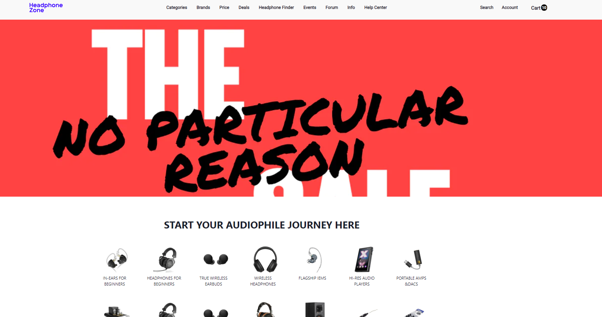
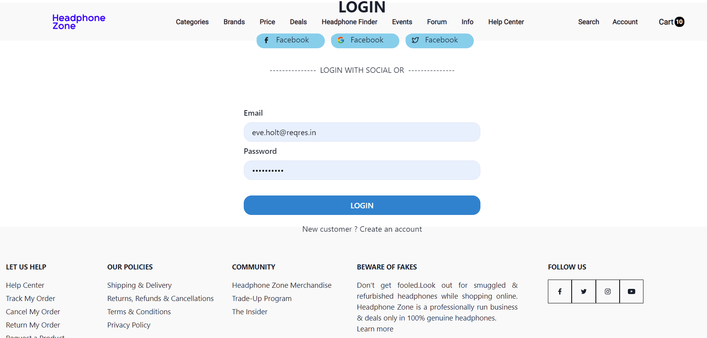

This is a individual Project from Masai School in the Construct Week . In the span of 6 day, I create this webstie

### Info
Headphone Zone is India’s first exclusive online store for headphones, earphones and personal Audio devices featuring the world's finest headphones from brands renowned for their sound, design and style.

### Challenges 
During the project, i got faced many issue with make the dynamic page with the help of API and how to go one page to another page . I faced many challenges about
React Js Context Api, params. but I learn and apply the good method for this project.
###

###
### Tech Stack & Tools  
 For Fronted - React Js | CSS3 | JavaScript | Chakra UI
 For DataBase - LocalHost

### Conclusion :
This project was a chance to learn and apply new skillls with this project and also how to mange solo project  

